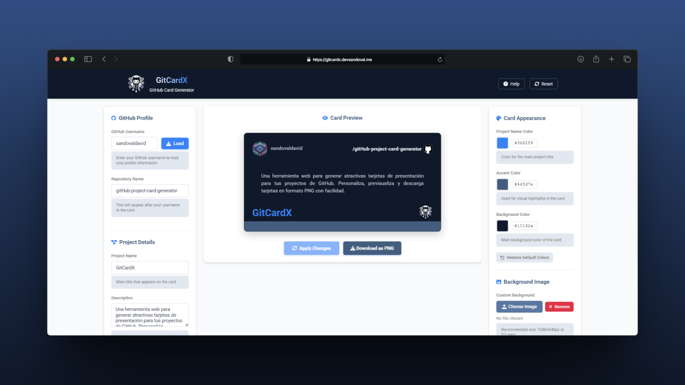

# 🧠 GitCardX: GitHub Project Card Generator

<div align="right">
    <a href="README.md">Español</a>
</div>

**GitCardX** is a web tool that generates attractive presentation cards for your GitHub projects. It
allows you to customize colors, text, and images, with real-time preview and high-quality PNG
download.

<div align="center">
    
    


</div>

---

## 📌 Description

GitCardX solves the problem of visual presentation for GitHub projects, allowing you to create
informative and attractive cards that can be shared on profiles, blogs, or social networks. The
generator offers an intuitive interface that automates the design process, eliminating the need for
complex graphic tools.

The application presents an interface divided into three panels: configuration, preview, and
customization, with specific controls for each aspect of the card. The final result is a 1280×640px
PNG image ready to use on any platform.

---

## ✨ Features

-   [x] **GitHub Profile Loading** - Automatic retrieval of avatar and username
-   [x] **Content Customization** - Customizable project name, repository, and description
-   [x] **Color Picker** - Customization of colors for background, border, and text
-   [x] **Image Upload** - Support for project logo and custom background
-   [x] **Opacity Control** - Adjustment of overlay for background images
-   [x] **Real-time Preview** - Instant update when applying changes
-   [x] **PNG Export** - High-quality image generation (1280×640px)
-   [x] **Local Persistence** - Automatic saving of preferences in localStorage
-   [x] **Responsive Design** - Functional on mobile and desktop devices
-   [x] **Notification System** - Visual feedback on actions and errors
-   [ ] **Multiple Format Export** - SVG, PDF (planned)

---

## 🛠️ Technologies

-   **Frontend**:
    -   HTML5 and CSS3 (Flexbox, CSS Variables)
    -   Vanilla JavaScript (ES6+)
    -   Modular architecture based on SOLID principles
-   **Libraries**:

    -   [html2canvas](https://html2canvas.hertzen.com/) - HTML to image conversion
    -   [Font Awesome](https://fontawesome.com/) - Iconography
    -   [Google Fonts](https://fonts.google.com/) - Roboto typography

-   **Storage**:
    -   localStorage API - Configuration persistence
-   **Integration**:
    -   GitHub API - Profile information retrieval
-   **Development**:
    -   Modular component architecture
    -   Object-oriented design
    -   EventManager for inter-module communication

---

## ⚙️ Installation

The project does not require a build process, as it is a static web application:

```bash
# Clone the repository
git clone https://github.com/sandovaldavid/github-project-card-generator.git

# Navigate to the directory
cd github-project-card-generator

# Optional: start a local server with Python
python -m http.server 8000

# Optional: start a local server with Node.js
npx serve
```

---

## 🚀 Usage

1. **GitHub Information**

    - Enter your username and click "Load" to load your profile picture.

2. **Project Information**

    - Complete the repository name, project title, and description.

3. **Customization**

    - Select colors for the title, border, and background.
    - Upload project logo and/or background image (optional).
    - Adjust overlay opacity if you add a background.

4. **Preview and Download**
    - Click "Apply Changes" to update the preview.
    - Click "Download as PNG" to download the card as an image.

---

## 🖼️ Screenshots

<p align="center">
  
</p>

---

## 📁 Project Structure

The application follows a modular architecture organized by responsibilities:

```
📦 root/
 ┣ 📂assets/               # Static resources
 ┃ ┣ 📂icons/              # Application icons
 ┃ ┣ 📂logo/               # Project logo
 ┃ ┗ 📂mockup/             # Example images
 ┣ 📂static/
 ┃ ┣ 📂js/                 # JavaScript logic
 ┃ ┃ ┣ 📂components/       # UI components
 ┃ ┃ ┣ 📂core/             # Application core
 ┃ ┃ ┣ 📂services/         # Services (GitHub, export)
 ┃ ┃ ┗ 📂utils/            # Utilities
 ┃ ┗ 📂styles/             # CSS styles
 ┃   ┗ 📂components/       # Modular styles
 ┣ 📜index.html            # Entry point
 ┗ 📜README.md             # Documentation
```

---

## 🤝 Contributions

Contributions are welcome, follow these steps:

1. Fork the project
2. Create a branch for your feature (`git checkout -b feature/amazing-feature`)
3. Commit your changes (`git commit -m 'Add some amazing feature'`)
4. Push to the branch (`git push origin feature/amazing-feature`)
5. Open a Pull Request

---

## 🪪 License

This project is under the MIT license. See the LICENSE file for more information.

---

## 👨‍💻 Author

### [David Sandoval](https://github.com/sandovaldavid)

-   🌐 Portfolio: [devsandoval.me](https://devsandoval.me)
-   💼 LinkedIn: [@devsandoval](https://linkedin.com/in/devsandoval)
-   💻 GitHub: [@sandovaldavid](https://github.com/sandovaldavid)
-   📧 Email: [contact@devsandoval.me](mailto:contact@devsandoval.me)

---

<div align="center">
  <p>
    Do you like this project? Give it a ⭐️!
  </p>
  <p>
    © 2025 GitCardX
  </p>
</div>
