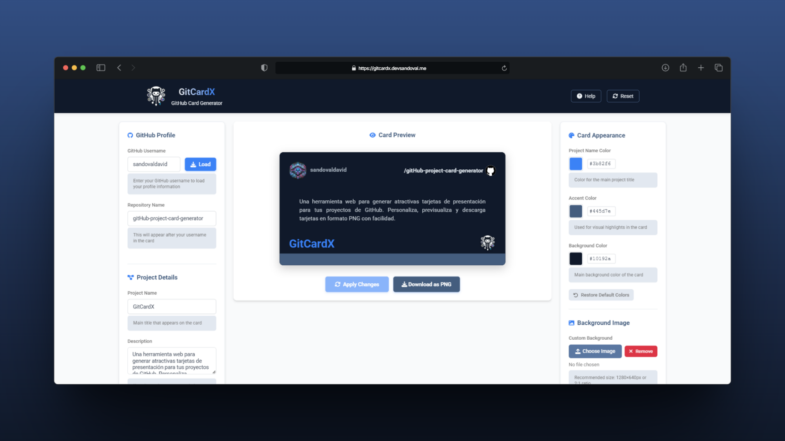

# 🧠 GitCardX: Generador de Tarjetas para Proyectos GitHub

**GitCardX** es una herramienta web que genera atractivas tarjetas de presentación para tus
proyectos de GitHub. Permite personalizar colores, texto e imágenes, con vista previa en tiempo real
y descarga en formato PNG de alta calidad.

<div align="center">
    
    


</div>

---

## 📌 Descripción

GitCardX resuelve el problema de presentación visual de proyectos GitHub, permitiendo crear tarjetas
informativas y atractivas que pueden compartirse en perfiles, blogs o redes sociales. El generador
ofrece una interfaz intuitiva que automatiza el proceso de diseño, eliminando la necesidad de
herramientas gráficas complejas.

La aplicación presenta una interfaz dividida en tres paneles: configuración, previsualización y
personalización, con controles específicos para cada aspecto de la tarjeta. El resultado final es
una imagen PNG de 1280×640px lista para usar en cualquier plataforma.

---

## ✨ Características

-   [x] **Carga de perfil GitHub** - Obtención automática de avatar y nombre de usuario
-   [x] **Personalización de contenido** - Nombre de proyecto, repositorio y descripción
        personalizable
-   [x] **Selector de colores** - Personalización de colores para fondo, borde y texto
-   [x] **Subida de imágenes** - Soporte para logo de proyecto y fondo personalizado
-   [x] **Control de opacidad** - Ajuste del overlay para imágenes de fondo
-   [x] **Vista previa en tiempo real** - Actualización instantánea al aplicar cambios
-   [x] **Exportación a PNG** - Generación de imagen de alta calidad (1280×640px)
-   [x] **Persistencia local** - Guardado automático de preferencias en localStorage
-   [x] **Diseño responsivo** - Funcional en dispositivos móviles y de escritorio
-   [x] **Sistema de notificaciones** - Feedback visual sobre acciones y errores
-   [ ] **Exportación en múltiples formatos** - SVG, PDF (planificado)

---

## 🛠️ Tecnologías

-   **Frontend**:
    -   HTML5 y CSS3 (Flexbox, Variables CSS)
    -   JavaScript vanilla (ES6+)
    -   Arquitectura modular basada en principios SOLID
-   **Librerías**:

    -   [html2canvas](https://html2canvas.hertzen.com/) - Conversión HTML a imagen
    -   [Font Awesome](https://fontawesome.com/) - Iconografía
    -   [Google Fonts](https://fonts.google.com/) - Tipografía Roboto

-   **Almacenamiento**:
    -   localStorage API - Persistencia de configuraciones
-   **Integración**:
    -   GitHub API - Obtención de información de perfiles
-   **Desarrollo**:
    -   Arquitectura modular de componentes
    -   Diseño orientado a objetos
    -   EventManager para comunicación entre módulos

---

## ⚙️ Instalación

El proyecto no requiere proceso de construcción, al ser una aplicación web estática:

```bash
# Clonar el repositorio
git clone https://github.com/sandovaldavid/github-project-card-generator.git

# Navegar al directorio
cd github-project-card-generator

# Opcional: iniciar un servidor local con Python
python -m http.server 8000

# Opcional: iniciar un servidor local con Node.js
npx serve
```

---

## 🚀 Uso

1. **Información de GitHub**

    - Introduce tu nombre de usuario y haz clic en "Load" para cargar tu imagen de perfil.

2. **Información del proyecto**

    - Completa el nombre del repositorio, título del proyecto y descripción.

3. **Personalización**

    - Selecciona colores para el título, borde y fondo.
    - Sube logo del proyecto y/o imagen de fondo (opcional).
    - Ajusta la opacidad del overlay si añades fondo.

4. **Previsualización y Descarga**
    - Haz clic en "Apply Changes" para actualizar la vista previa.
    - Haz clic en "Download as PNG" para descargar la tarjeta como imagen.

---

## 🖼️ Capturas de Pantalla

<p align="center">
  
</p>

---

## 📁 Estructura del Proyecto

La aplicación sigue una arquitectura modular organizada por responsabilidades:

```
📦 root/
 ┣ 📂assets/               # Recursos estáticos
 ┃ ┣ 📂icons/              # Iconos de la aplicación
 ┃ ┣ 📂logo/               # Logo del proyecto
 ┃ ┗ 📂mockup/             # Imágenes de ejemplo
 ┣ 📂static/
 ┃ ┣ 📂js/                 # Lógica JavaScript
 ┃ ┃ ┣ 📂components/       # Componentes UI
 ┃ ┃ ┣ 📂core/             # Núcleo de la aplicación
 ┃ ┃ ┣ 📂services/         # Servicios (GitHub, exportación)
 ┃ ┃ ┗ 📂utils/            # Utilidades
 ┃ ┗ 📂styles/             # Estilos CSS
 ┃   ┗ 📂components/       # Estilos modulares
 ┣ 📜index.html            # Punto de entrada
 ┗ 📜README.md             # Documentación
```

---

## 🤝 Contribuciones

Las contribuciones son bienvenidas, sigue estos pasos:

1. Haz un fork del proyecto
2. Crea una rama con tu funcionalidad (`git checkout -b feature/amazing-feature`)
3. Haz commit de tus cambios (`git commit -m 'Add some amazing feature'`)
4. Sube los cambios (`git push origin feature/amazing-feature`)
5. Abre un Pull Request

---

## 🪪 Licencia

Este proyecto está bajo la licencia MIT. Ver el archivo LICENSE para más información.

---

## 👨‍💻 Autor

### [David Sandoval](https://github.com/sandovaldavid)

-   🌐 Portafolio: [devsandoval.me](https://devsandoval.me)
-   💼 LinkedIn: [@devsandoval](https://linkedin.com/in/devsandoval)
-   💻 GitHub: [@sandovaldavid](https://github.com/sandovaldavid)
-   📧 Email: [contact@devsandoval.me](mailto:contact@devsandoval.me)

---

<div align="center">
  <p>
    ¿Te gusta este proyecto? ¡Dale una ⭐️!
  </p>
  <p>
    © 2025 GitCardX
  </p>
</div>
